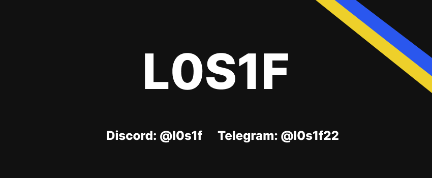

<h1 align="center">👋 Hello! I'm LOSIF </h1>

 

## About me

I am a Junior C++ developer from Ukraine. 
I am very interested in programming in C++. I am also learning Python because I want to study neural networks.

## 📌Pinned

  
<h2><b>📚 My stack</b></h2>

  

    <h3>Langs</h3>
    
    <h3>Frameworks / Tools</h3>
    
    <h3>Software</h3>
    
     
  

  
<h2><b>⭐GitHub stats</b></h2>

  

   
    
   
     
   
  

